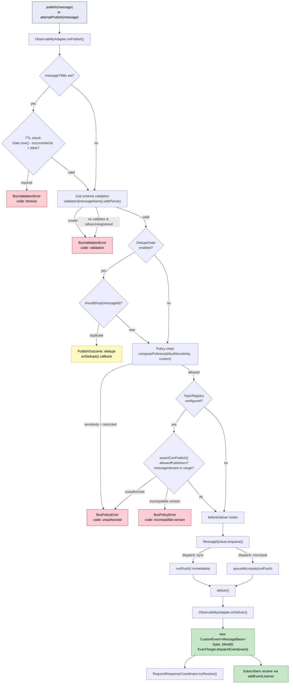
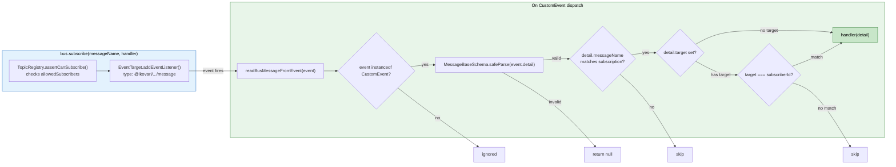
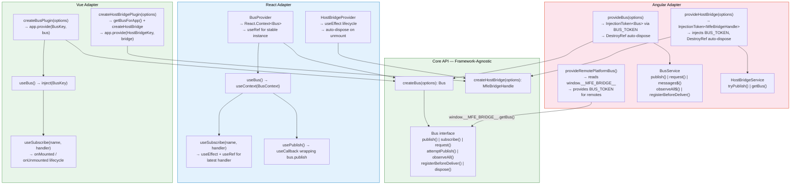
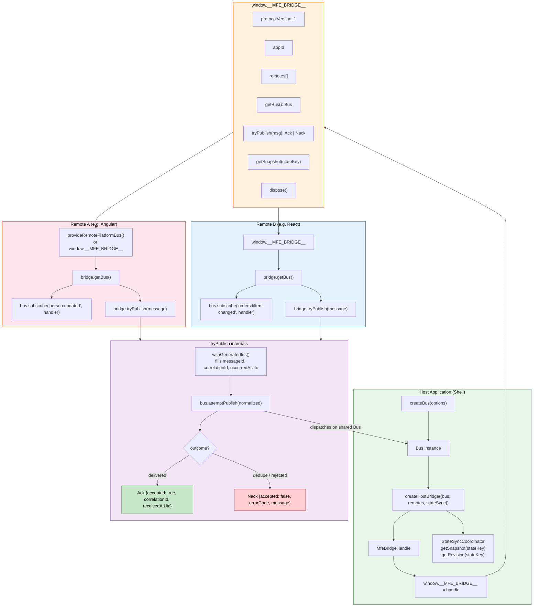
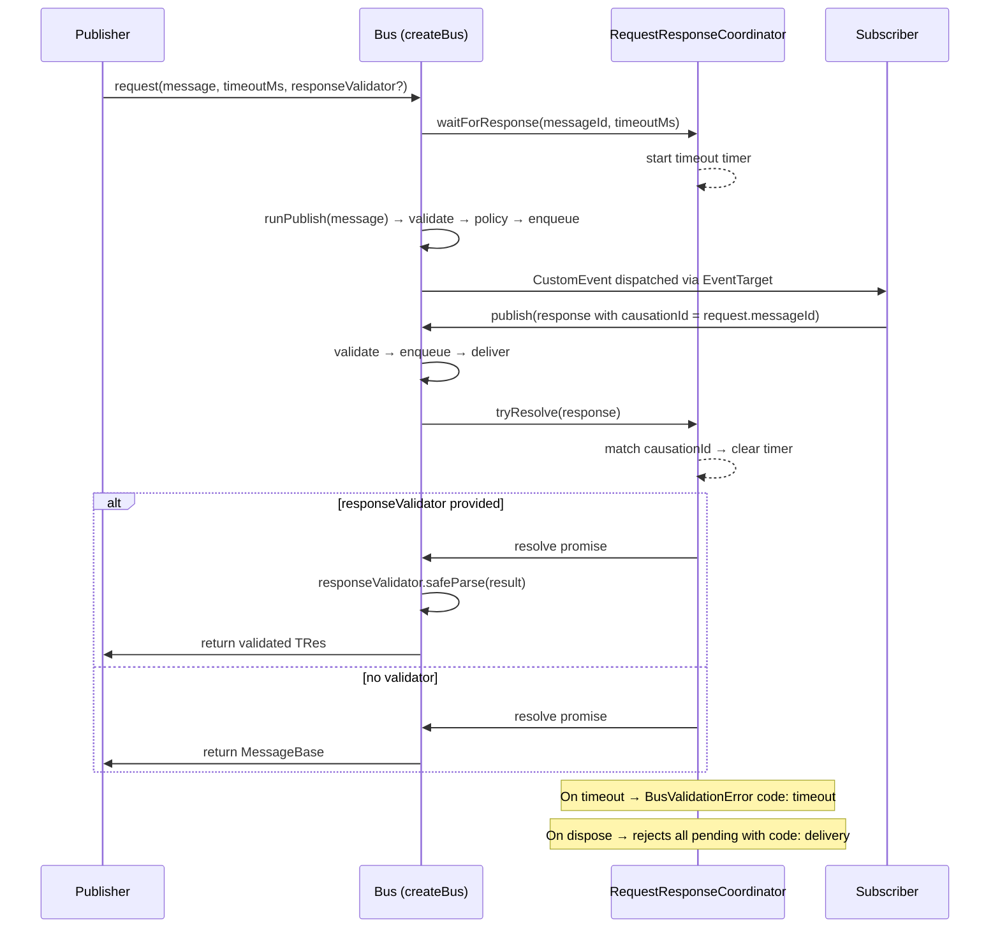
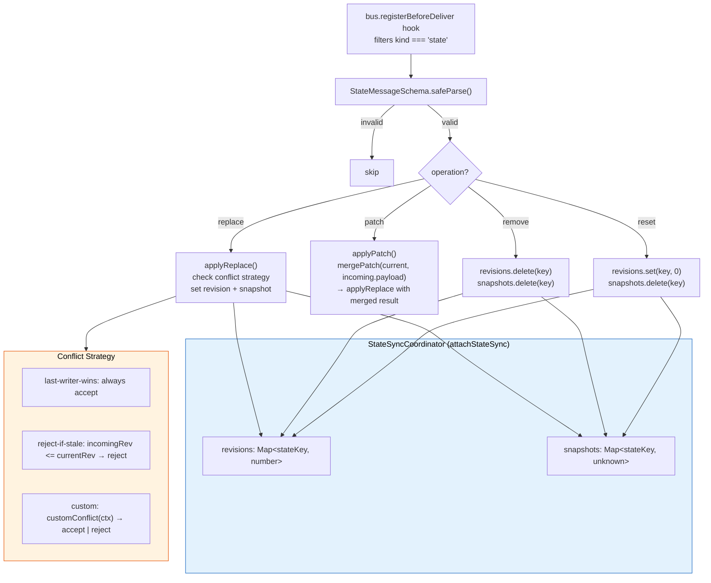
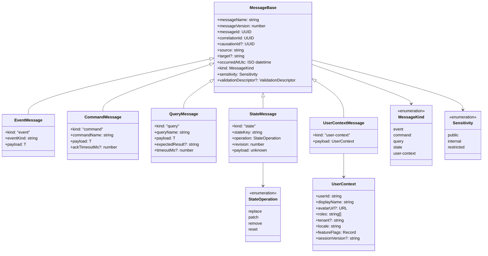

# @lkovari/microfrontend-platform-communication

**Status:** Proof of Concept (`0.x`). Production readiness is tracked in [platform-communication-rfc.md](platform-communication-rfc.md) section **1.5**. Target production release: `1.0.0` when P1–P2 checklist items are complete.

The publishable package lives in [`mfe-platform-communication/`](mfe-platform-communication/) as `@lkovari/microfrontend-platform-communication` ([npm](https://www.npmjs.com/package/@lkovari/microfrontend-platform-communication)).

This library is a framework-agnostic solution for messaging between microfrontends (Angular, React, Vue).
It uses a host-orchestrated communication model. Runtime bus is based on browser EventTarget and CustomEvent,
wrapped with a typed API. Contracts are TypeScript types; validation is done by Zod on the bus boundary.

## Topology

Microfrontends (remotes) are not communicate directly with each other.
All messages go through Host (Shell Bus).

```text
                             typed messages
 Remote A  ──────────────────────────────►  ┌────────────────────────────┐
                                             │ Host / Shell Bus           │
                             typed messages  │ + Host Bridge              │
 Remote B  ──────────────────────────────►  │ + Policy                   │
                                             │ + State sync               │
                             typed messages  │                            │
 Remote C  ──────────────────────────────►  └─────────────┬──────────────┘
                                                         │
                                                         ▼
                                                ┌──────────────────────────────────────┐
                                                │ Backend / BFF (optional, e.g. NestJS)│
                                                └──────────────────────────────────────┘
```

**Remotes → Host**

```text
Remote A ---> Host Bus
Remote B ---> Host Bus
Remote C ---> Host Bus
```

**Remote → Remote (only via Host; no direct remote-to-remote)**

```text
Remote A ---> Host Bus <--- Remote B
Remote C ---> Host Bus
```

**Host → Remotes (simplified)**

```text
Host Bus ---> Remote A
Host Bus ---> Remote B
Host Bus ---> Remote C
```

Host may also connect to Backend / BFF (optional, e.g. NestJS).

One shared bus instance exist, exposed via window.__MFE_BRIDGE__.

Important:
- Remote-to-remote communication also go via Host
- Separate createBus() instances cannot see each other events

## Architecture

### Package Layer Overview

```mermaid
graph TB
    subgraph External["External — WHATWG DOM Standard"]
        ET["EventTarget"]
        CE["CustomEvent&lt;MessageBase&gt;"]
        EV["Event"]
        QM["queueMicrotask()"]
        CR["crypto.randomUUID()"]
    end

    subgraph Contracts["Contracts & Schemas"]
        MB["MessageBase"]
        EM["EventMessage"]
        CM["CommandMessage"]
        QMsg["QueryMessage"]
        SM["StateMessage"]
        UCM["UserContextMessage"]
        ENV["Ack / Nack / AckResult"]
        ZS["Zod Schemas"]

        MB --- EM
        MB --- CM
        MB --- QMsg
        MB --- SM
        MB --- UCM
        ZS -.->|validates| MB
    end

    subgraph Core["Core Engine"]
        Bus["createBus()"]
        HB["createHostBridge()"]
        Disp["MessageQueue<br/>sync | microtask"]
        Ded["DedupeGate"]
        Pol["Policy<br/>defaultSensitivityPolicy<br/>composePolicies"]
        Reg["TopicRegistry<br/>allowedPublishers<br/>allowedSubscribers"]
        RR["RequestResponseCoordinator"]
        SS["StateSyncCoordinator<br/>replace | patch | remove | reset"]
        Obs["ObservabilityAdapter"]
        BEV["readBusMessageFromEvent()"]

        Bus --> Disp
        Bus --> Ded
        Bus --> Pol
        Bus --> Reg
        Bus --> RR
        Bus --> BEV
        HB --> Bus
        HB --> SS
    end

    subgraph Adapters["Framework Adapters"]
        subgraph NG["Angular"]
            NGP["provideBus()<br/>provideHostBridge()"]
            NGS["BusService<br/>HostBridgeService"]
            NGR["provideRemotePlatformBus()"]
        end
        subgraph RC["React"]
            RCP["BusProvider<br/>HostBridgeProvider"]
            RCH["useBus()<br/>useSubscribe()<br/>usePublish()"]
        end
        subgraph VU["Vue"]
            VUP["createBusPlugin()<br/>createHostBridgePlugin()"]
            VUH["useBus()<br/>useSubscribe()"]
        end
    end

    NGP --> Bus
    NGP --> HB
    NGS --> Bus
    NGR -->|"window.__MFE_BRIDGE__.getBus()"| HB
    RCP --> Bus
    RCP --> HB
    RCH --> Bus
    VUP --> Bus
    VUP --> HB
    VUH --> Bus

    Bus --> ET
    Bus --> CE
    Bus --> EV
    Disp --> QM
    HB --> CR
    BEV --> CE
    Obs -.->|hooks| Bus

    ZS -->|"safeParse on publish"| Bus
    MB -->|"typed envelope"| Bus
    ENV -->|"tryPublish result"| HB

    style External fill:#fce4ec,stroke:#c62828,color:#000
    style Contracts fill:#e3f2fd,stroke:#1565c0,color:#000
    style Core fill:#e8f5e9,stroke:#2e7d32,color:#000
    style Adapters fill:#fff3e0,stroke:#e65100,color:#000
    style NG fill:#fff3e0,stroke:#dd2c00,color:#000
    style RC fill:#fff3e0,stroke:#0277bd,color:#000
    style VU fill:#fff3e0,stroke:#2e7d32,color:#000
```



### Publish Pipeline — Message Flow



### Subscribe & Delivery Flow



### Framework Adapter Pattern



### Host–Remote Bridge Communication



### Request–Response Correlation



### State Sync Operations



### Message Contract Hierarchy



## Install

pnpm add @lkovari/microfrontend-platform-communication zod

Optional peer dependencies:
- @angular/core
- react
- rxjs
- vue

## Entry points

- root package: contracts, schemas, core, Angular adapter
- /contracts: only types
- /schemas: Zod validation schemas
- /core: createBus, createHostBridge, policy, registry, state sync, observability adapters
- /angular: Angular providers and service
- /react: React providers and hooks
- /vue: Vue plugins and composables

Note:
React and Vue hooks are NOT exported from root, must import from /react or /vue.

## Quick usage

Host side:

Create bus with validators, then create bridge.

Example:

const bus = createBus({
  appId: 'shell-host',
  dispatch: 'microtask',
  dedupe: { enabled: true, windowMs: 5000 },
  validators: {
    'orders:filters-changed': EventMessageSchema,
  },
});

createHostBridge({
  appId: 'shell-host',
  bus,
  remotes: ['remote-orders', 'remote-profile'],
  stateSync: { enabled: true, initialRevisions: { person: 0 } },
});

Remote side:

Get bus from global bridge:

const bridge = window.__MFE_BRIDGE__;
const bus = bridge.getBus();

Subscribe:

const PersonUpdatedSchema = EventMessageSchema.extend({
  payload: z.object({
    id: z.string(),
    name: z.string(),
  }),
});

bus.subscribe(
  'person:updated',
  (message) => {
    const parsed = PersonUpdatedSchema.safeParse(message);
    if (!parsed.success) {
      return;
    }
    console.log(parsed.data.payload.name);
  },
  { subscriberId: 'remote-profile' },
);

Publishing:

Use bridge.tryPublish(message)
Host will fill missing metadata like:
- messageId
- correlationId
- occurredAtUtc

Also return Ack / Nack result.

For `request()`, prefer passing a response validator as third argument:

`bus.request(requestMessage, 5000, ResponseSchema)`

## Message kinds (`MessageKind`)

The sections **`event`** through **`user-context`** below are the kinds implemented in code. See also **[Possible future kinds (not in code)](#possible-future-kinds-not-in-code)** for ideas not in `MessageKind` today.

Every message has a `kind` field that classifies how the bus and host should treat it. All kinds share the same base envelope (`messageName`, `messageVersion`, `messageId`, `correlationId`, optional `causationId`, `source`, optional `target`, `occurredAtUtc`, `sensitivity`, optional `validationDescriptor`). Zod schemas live under `/schemas`; TypeScript contracts under `/contracts`.

### `event`

Fire-and-forget notifications: something already happened and subscribers may react. There is no built-in reply channel; use `correlationId` / separate messages if you need follow-up traffic.

| Field | Role |
| --- | --- |
| `eventKind` | Non-empty string sub-type of the event (e.g. domain-specific label alongside `messageName`). |
| `payload` | Arbitrary data for subscribers. |

Typical uses: filters changed, navigation completed, feature flags updated, remote readiness signals.

### `command`

An imperative action the host or another participant should perform. Commands often imply acknowledgement semantics at the bridge layer (see host bridge / policy); the contract includes an optional `ackTimeoutMs` field for application-layer ACK handling. **The bus does not read `ackTimeoutMs` in 0.x** — implement timeouts in your handler or orchestration layer.

| Field | Role |
| --- | --- |
| `commandName` | Non-empty string naming the command. |
| `payload` | Arguments for the handler. |
| `ackTimeoutMs` | Optional hint for app-layer ACK wait (not enforced by the bus). |

Typical uses: request navigation, trigger a host-side operation, ask another remote to refresh.

### `query`

A request for information that expects a result shape. The contract allows naming the query, passing input `payload`, and optionally describing or bounding the response and wait time. **The bus does not read `timeoutMs` in 0.x** — use `bus.request()` with an explicit timeout or app-layer SLA logic.

| Field | Role |
| --- | --- |
| `queryName` | Non-empty string naming the query. |
| `payload` | Input to the query. |
| `expectedResult` | Optional string hint (e.g. result type or schema id) for validators or routing. |
| `timeoutMs` | Optional hint for app-layer wait (not enforced by the bus). |

Typical uses: read shared UI or host state without mutating it, resolve a capability or configuration snapshot.

### `state`

Synchronized shared state under a key, with explicit revisions and an operation that says how to apply the payload. Host bridge state sync is aligned with this model when enabled.

| Field | Role |
| --- | --- |
| `stateKey` | Non-empty string identifying the state slice (e.g. `person`, domain entity). |
| `operation` | One of `replace`, `patch`, `remove`, `reset` (see below). |
| `revision` | Non-negative integer; monotonic per `stateKey` for optimistic concurrency and ordering. |
| `payload` | The state value or delta, depending on operation and convention. |

**State operations**

| Operation | Meaning |
| --- | --- |
| `replace` | Substitute the entire value for `stateKey` with `payload`. |
| `patch` | Apply a partial update; `payload` is typically a merge or JSON-patch style delta (by convention). |
| `remove` | Drop the value for `stateKey` (payload may be empty or carry metadata). |
| `reset` | Restore initial or default state for that key. |

Typical uses: shared entity snapshot across remotes, host-managed session-scoped data with revision checks.

### `user-context`

A dedicated kind for the signed-in user’s **non-sensitive** display and routing context. The payload is structured (`UserContext`), not an unconstrained blob: user id, display name, optional avatar, UI roles, optional tenant, locale, feature flags, optional session version string.

Typical uses: broadcast after login, tenant or locale switch, role changes that affect UI only. Tokens and authorization matrices still belong on the server; this kind is for coordination and display alignment across microfrontends.

## Possible future kinds (not in code)

These values are **not** part of `MessageKind` in this repository; they are suggestions only. Teams sometimes model similar ideas on top of `event`, `command`, or `query`, or keep a separate enum outside the bus contracts:

| Kind (hypothetical) | Why it might exist |
| --- | --- |
| `notification` | User-visible alerts (toast, banner) with severity, deduplication id, and optional action ids—distinct from domain `event` noise. |
| `error` | Standardized failure envelope (code, message, retryable flag) for correlated replies instead of ad hoc error shapes in payloads. |
| `lifecycle` | Explicit mount/unmount, activation, or route-attached scope for a remote (host orchestration). |
| `capability` | Advertise or negotiate features, versions, or message names a remote supports (discovery). |
| `heartbeat` | Cheap periodic liveness or SLA probes, possibly with stricter TTL than generic events. |
| `dead-letter` | Move undeliverable or invalid messages to an auditable channel for tooling. |

Adding a new kind would require updating `MessageKind`, the corresponding Zod schemas, host bridge policy, and documentation together.

## Message categories

Auth:
- auth:login-completed
- auth:logout-completed
- session:expired

User:
- user:context-updated
- roles:changed

Navigation:
- navigation:requested
- navigation:completed

Cross-app:
- tenant:changed
- person:updated
- orders:filters-changed

Runtime:
- feature-flags:updated
- runtime:manifest-updated

Invalidation:
- cache:invalidated
- refresh-requested

Health (conventions — not built-in state machine in 0.x):

- `remote:ready` — remote mounted and subscribed; host may enable routes
- `remote:failed` — remote load or bootstrap failed; host may show fallback UI

## Design summary

- Single package with subpath exports
- Contracts define message structure; Zod validates at bus boundary
- `validationDescriptor` validates **shape only** on the bus — field rules (`min`, `max`, etc.) are metadata for tooling, not runtime bus enforcement
- Core handles policy, dedupe (with `tryPublish` dedupe `Nack`), TTL, correlation
- Optional `ObservabilityAdapter` + `ConsoleObservabilityAdapter` for structured hooks
- `attemptPublish` / bridge `tryPublish` return explicit `Nack` including `errorCode: 'dedupe'`
- `failFastOnDispatchError` avoids silent 5s `request()` timeout when `onDispatchError` swallows publish errors
- Host controls routing (`target` vs broadcast)
- `remotes[]` on the bridge is metadata — use `TopicRegistry` for ACL
- Contract snapshots in `contracts-snapshot/`; CI fails on uncommitted schema drift
- Restricted messages blocked by default

## Security model

Important rule: do **not** send sensitive data via the bus.

**Allowed on the bus (`public` / `internal`):**

- Display names, tenant id, locale, UI-only roles
- Feature flags, routing state, non-PII coordination payloads
- Structured `user-context` without tokens

**Never on the bus (any sensitivity):**

- Access tokens, refresh tokens, API keys
- Full auth claims or permission matrices
- PII (email, phone, government id, full address)
- Secrets, credentials, session cookies

**`internal` sensitivity policy:** use only for team-trusted coordination (UI routing state, layout, non-sensitive host metadata). Do not use `internal` to bypass restrictions for user PII or auth data.

**Enterprise recommendation:** configure `TopicRegistry` with `allowedPublishers` and `allowedSubscribers` per `messageName`. The bus does not cryptographically bind `source` — registry + deploy-time review is the ACL layer.

```typescript
const registry = new TopicRegistry();
registry.register({
  messageName: 'person:updated',
  allowedPublishers: ['remote-profile', 'shell-host'],
  allowedSubscribers: ['remote-orders', 'remote-profile', 'shell-host'],
  minMessageVersion: 1,
  maxMessageVersion: 1,
});

const bus = createBus({ appId: 'shell-host', validators, registry });
```

Backend is ALWAYS source of truth for authorization.

## Three types of state

1. Server state (truth)
2. Client cached state
3. UI derived state

Bus is only for coordination, NOT replace API or security.

## When to use

Good fit:
- multiple frameworks
- independent remotes
- backend-driven security
- low coupling

Not enough alone for:
- guaranteed delivery
- complex orchestration
- weak contract discipline teams

## Adapter examples

Angular (host):

- `provideBus` / `provideHostBridge` — `DestroyRef` disposes bus and bridge on teardown
- `injectBus` / `injectHostBridge`
- `BusService`: `publish`, `request`, `messages$`, `observeAll$`, `registerBeforeDeliver`, `dispose`

Angular (remote):

- `provideRemotePlatformBus()` — reads `window.__MFE_BRIDGE__` and provides `BUS_TOKEN`

React:

- `BusProvider`, `HostBridgeProvider`, `useSubscribe`, `usePublish`

Vue:

- `createBusPlugin`, `createHostBridgePlugin`, `useSubscribe`

## Examples workspace

Runnable Module Federation harness under [`examples/`](examples/):

- `host/` — shell with bus + bridge
- `remote-orders/` — federated remote using `tryPublish` and `getBus()`
- `federation-e2e/` — Playwright smoke (CI job `federation-e2e`)

```bash
pnpm install
pnpm --filter @lkovari/microfrontend-platform-communication build
cd examples && pnpm dev
```

Demo messages: `person:updated`, `orders:filters-changed`. See [examples/README.md](examples/README.md).

## NPM Deploy

Publishing targets only the library in [`mfe-platform-communication/`](mfe-platform-communication/) as **`@lkovari/microfrontend-platform-communication`** on the [public npm registry](https://www.npmjs.com/package/@lkovari/microfrontend-platform-communication). The repository root and `examples/` are private and are not published.

### Build

From the package directory:

```bash
cd mfe-platform-communication
pnpm install
pnpm build
```

`build` runs `rimraf dist` then **tsup** and produces `dist/` (published via `"files"`: `dist`, `README.md`, `LICENSE`).

Optional checks (also run automatically before publish):

```bash
pnpm lint
pnpm typecheck
pnpm test
pnpm test:coverage
pnpm format:check
pnpm export:schemas
```

From the **repository root**:

```bash
pnpm install
pnpm --filter @lkovari/microfrontend-platform-communication build
```

### Publish

Scripts are defined in [`mfe-platform-communication/package.json`](mfe-platform-communication/package.json):

| Script | Purpose |
| --- | --- |
| `build` | Clean and compile `dist/` with tsup |
| `prepublishOnly` | Runs `lint`, `typecheck`, `test`, and `build` automatically before `publish` |
| `release` | `pnpm publish --access public` |

`publishConfig.access` is `public` (required for the scoped package name).

> **Warning:** Before you release, log in to npm via `npm login`.

**Typical release flow:**

1. Bump `version` in `mfe-platform-communication/package.json` (npm rejects duplicate versions). Update [`CHANGELOG.md`](mfe-platform-communication/CHANGELOG.md) if needed.
2. Log in to npm once per machine: `npm login` (you need publish access on the `@lkovari` scope).
3. Publish from the package directory:

```bash
cd mfe-platform-communication
pnpm release
```

Equivalent: `pnpm publish --access public`.

**Dry run** (recommended before a real publish):

```bash
cd mfe-platform-communication
pnpm publish --access public --dry-run
```

`prepublishOnly` still runs unless you pass `--ignore-scripts` (not recommended).

### What is not published

| Location | Role |
| --- | --- |
| Repository root `package.json` | Private workspace orchestration only |
| `examples/` | Private Module Federation demo (local dev / E2E) |
| `src/` | Not in the npm tarball; consumers receive `dist/` only |

**Consumers install:**

```bash
pnpm add @lkovari/microfrontend-platform-communication zod
```

## Issues 1-19 updates (what changed and why)

1. Adapter `onConflict` forwarding: Angular/React/Vue now pass `onConflict` to `createHostBridge`; purpose is consistent bridge conflict behavior across frameworks.
2. Strict request matching: `request()` now resolves only when `response.causationId === request.messageId`; purpose is deterministic request-response correlation.
3. React HostBridgeProvider stability: remotes dependency tracking is stable for equal values; purpose is avoiding unnecessary bridge recreation.
4. React `useSubscribe` handler stability: latest handler is used without resubscribe churn; purpose is runtime stability with inline closures.
5. Angular DI guard errors: BusService and HostBridgeService throw clear provider setup errors; purpose is actionable diagnostics instead of opaque injector failures.
6. Schema/contract drift hardening: contracts are derived from schemas; purpose is reducing schema/type divergence risk.
7. Nullish metadata generation: metadata fallback uses nullish behavior; purpose is preserving valid falsy values.
8. Query contract cleanup: removed phantom `_TResult`; purpose is cleaner and less misleading query typing.
9. `avatarUrl` validation: URL format validation added; purpose is stronger payload correctness.
10. Ack semantics: `AckResult` uses `accepted` discriminant; purpose is explicit acceptance semantics.
11. State patch semantics: patch follows merge-patch style behavior; purpose is predictable and consistent patch application.
12. Sync dispatcher re-entrancy guard: queue flush is re-entrancy-safe; purpose is preventing recursion-related runtime failures.
13. Vue subscription lifecycle: `useSubscribe` subscribes on mounted/unmounted lifecycle; purpose is avoiding premature or leaked subscriptions.
14. HostBridgeService typing: `getBus()` has explicit return type; purpose is API clarity and stronger typing.
15. Angular provider return types: provider helpers return explicit `EnvironmentProviders`; purpose is stronger Angular API typing.
16. TTL coverage: dedicated tests verify expired/invalid/future timestamp behavior; purpose is reliable temporal validation.
17. Root barrel consistency: Angular is not exported from root barrel; purpose is consistent subpath entry strategy.
18. `validationDescriptor` structure validation: known shape is validated; purpose is stricter runtime metadata validation.
19. Response validation + Angular matrix CI: optional response validator in request path and Angular compatibility workflow; purpose is runtime safety and multi-version confidence.
20. TopicRegistry tests + bus integration: ACL and messageVersion window enforced at publish/subscribe; purpose is enterprise policy safety.
21. Dedupe Nack on `tryPublish`: duplicate `messageId` returns `errorCode: 'dedupe'`; purpose is observable dedupe instead of silent drop.
22. `failFastOnDispatchError`: `request()` rejects immediately when publish fails under `onDispatchError`; purpose is avoiding 5s silent timeout trap.
23. ObservabilityAdapter: optional `onPublish` / `onDeliver` / `onError` / `onRequestTimeout` hooks; purpose is SRE-friendly instrumentation.
24. Angular remote API: `provideRemotePlatformBus`, `injectHostBridge`, extended `BusService`; purpose is production Angular integration.
25. Bridge `getSnapshot(stateKey)` when state sync enabled; purpose is remote bootstrap without stale UI.
26. Examples workspace + federation E2E CI: real MF host/remote build and smoke test; purpose is integration regression detection.

## Test list with purpose

### `test/bus.spec.ts`
- `publish/subscribe roundtrip` - verifies base bus delivery path.
- `microtask vs synchronous ordering` - verifies dispatch mode ordering guarantees.
- `subscribe returns Unsubscribe and dispose clears listeners` - verifies unsubscribe and dispose listener cleanup.
- `reentrancy-safe nested publish via queue` - verifies nested publish ordering without loss.
- `sync dispatch handles long re-entrant chains without stack overflow` - verifies re-entrant sync stability under depth.
- `dedupe drops duplicate messageId within window` - verifies deduplication window behavior.
- `validator rejects invalid envelopes` - verifies schema validation on publish.
- `targeted delivery only reaches matching subscriberId on shared bus` - verifies one-target routing.
- `broadcast from host reaches all remotes on shared bus` - verifies host-to-all remotes broadcast.
- `targeted remote-to-host delivery reaches only host subscriber` - verifies remote-to-host targeted direction.
- `supports command messages via runtime publish-subscribe` - verifies command kind runtime path.
- `supports query messages via runtime publish-subscribe` - verifies query kind runtime path.
- `supports user-context messages via runtime publish-subscribe` - verifies user-context kind runtime path.
- `request resolves when response references causationId` - verifies strict causation success path.
- `request times out when response only references correlationId` - verifies correlation-only response is rejected.
- `request times out when response has no matching causationId or correlationId` - verifies unmatched response timeout.
- `request times out when causationId does not match request messageId` - verifies strict causation mismatch timeout.
- `request resolves with first matching response when duplicate responses arrive` - verifies first response wins.
- `onDispatchError captures microtask validation failures` - verifies dispatch error hook behavior.
- `onSubscriberError is invoked when subscribe handler returns a rejected Promise` - verifies async subscriber error routing.
- `onSubscriberError is preferred over onDispatchError for subscribe failures` - verifies subscriber error precedence.
- `logs to console when subscribe fails and no error handlers are set` - verifies fallback error visibility.
- `observeAll forwards sync handler throws to onSubscriberError` - verifies observeAll error pipeline.
- `request validates response when validator is provided` - verifies response schema validation path.
- `TTL rejects expired and invalid timestamps` - verifies TTL rejection for invalid/expired messages.
- `TTL accepts future timestamps and non-expired messages` - verifies TTL acceptance for valid timing.

### `test/host-bridge.spec.ts`
- `exposes window.__MFE_BRIDGE__ with versioned handshake` - verifies bridge registration and protocol metadata.
- `tryPublish rejects empty string ids and reports Nack` - verifies invalid inbound metadata handling.
- `tryPublish returns accepted ack for valid messages` - verifies happy-path ack response.
- `restricted sensitivity returns unauthorized Nack` - verifies sensitivity policy enforcement.
- `policy hook runs on publish path` - verifies policy integration.
- `remote-to-remote is host-mediated: separate buses do not cross-deliver` - verifies isolation across independent buses.
- `remote-to-remote works when sharing host bus instance` - verifies host-mediated remote routing on shared bus.
- `default onConflict throws when a valid bridge is already on window` - verifies default conflict policy.
- `onConflict return-existing returns the same handle when options match` - verifies idempotent return-existing behavior.
- `onConflict return-existing throws when remotes differ` - verifies mismatch protection.
- `onConflict replace disposes the previous handle and sets a new bridge` - verifies replace behavior.
- `throws when window has an invalid global and onConflict is throw` - verifies invalid global handling in throw mode.
- `onConflict replace removes invalid value from window and creates a real bridge` - verifies invalid global recovery in replace mode.
- `isValidMfeBridgeHandle rejects plain objects and accepts real handles` - verifies bridge-handle type guard.

### `test/state-sync.spec.ts`
- `applies replace, patch, remove, reset` - verifies core state operation flow.
- `patch performs deep object merge for nested fields` - verifies nested merge behavior.
- `patch follows merge-patch semantics for non-object payloads` - verifies non-object replacement semantics.
- `reject-if-stale blocks non-monotonic revisions` - verifies stale revision protection.
- `custom conflict strategy can reject` - verifies extensible conflict strategy handling.

### `test/validation.spec.ts`
- `accepts valid envelopes` - verifies baseline schema acceptance.
- `rejects bad uuid` - verifies UUID field enforcement.
- `rejects bad occurredAtUtc` - verifies timestamp format enforcement.
- `rejects missing kind` - verifies required kind discriminator.
- `rejects wrong sensitivity` - verifies allowed sensitivity enum.
- `rejects negative revision for state messages` - verifies revision bounds.
- `ValidationDescriptor metadata validates known structure` - verifies accepted metadata structure.
- `rejects invalid ValidationDescriptor shape` - verifies malformed metadata rejection.
- `rejects invalid avatarUrl values` - verifies avatar URL format rules.

### `test/adapters.spec.ts`
- `Angular BusService wires Observable unsubscribe to bus subscription` - verifies Angular RxJS cleanup.
- `Angular BusService throws readable error when provideBus is missing` - verifies Angular missing-provider diagnostics.
- `Angular HostBridgeService throws readable error when provideHostBridge is missing` - verifies bridge provider diagnostics.
- `React useSubscribe cleans up on unmount` - verifies React unmount cleanup.
- `React HostBridgeProvider does not recreate bridge when remotes values are unchanged` - verifies React bridge stability.
- `React useSubscribe uses the latest inline handler closure after rerender` - verifies React latest closure behavior.
- `Vue useSubscribe cleans up on unmount` - verifies Vue lifecycle cleanup.
- `two subscribers on one bus can model remote targeting` - verifies targeting model across subscribers.

## Tech Information

| Technology | Role | Website |
| --- | --- | --- |
| WHATWG DOM Standard | Runtime bus backbone — `EventTarget`, `CustomEvent`, `Event` for in-process pub/sub messaging | [dom.spec.whatwg.org](https://dom.spec.whatwg.org/) |
| TypeScript | Primary language, strict mode, ES2022 target | [typescriptlang.org](https://www.typescriptlang.org/) |
| Zod | Runtime schema validation on the bus boundary | [zod.dev](https://zod.dev/) |
| tsup | Library bundler (ESM + CJS, dts, tree-shake) | [tsup.egoist.dev](https://tsup.egoist.dev/) |
| Vitest | Unit and integration test runner | [vitest.dev](https://vitest.dev/) |
| ESLint | Linting (flat config, typescript-eslint) | [eslint.org](https://eslint.org/) |
| Prettier | Code formatting | [prettier.io](https://prettier.io/) |
| pnpm | Package manager and workspace orchestration | [pnpm.io](https://pnpm.io/) |
| Node.js | Runtime (>=18.17.0) | [nodejs.org](https://nodejs.org/) |
| Angular | Framework adapter (peer >=17.0.0) | [angular.dev](https://angular.dev/) |
| React | Framework adapter (peer >=18.0.0) | [react.dev](https://react.dev/) |
| Vue | Framework adapter (peer >=3.3.0) | [vuejs.org](https://vuejs.org/) |
| RxJS | Observable integration for Angular BusService | [rxjs.dev](https://rxjs.dev/) |
| Webpack Module Federation | Examples workspace (host + remote demo) | [webpack.js.org](https://webpack.js.org/) |
| Playwright | E2E smoke tests for federation examples | [playwright.dev](https://playwright.dev/) |
| tsx | TypeScript execution for scripts | [tsx.is](https://tsx.is/) |
| rimraf | Cross-platform `rm -rf` for clean builds | [github.com/isaacs/rimraf](https://github.com/isaacs/rimraf) |
| jsdom | DOM environment for Vitest adapter tests | [github.com/jsdom/jsdom](https://github.com/jsdom/jsdom) |
| zod-to-json-schema | Contract snapshot export (Zod → JSON Schema) | [github.com/StefanTerdell/zod-to-json-schema](https://github.com/StefanTerdell/zod-to-json-schema) |
| npm | Public registry for package publishing | [npmjs.com](https://www.npmjs.com/) |

## Appendix: Web Messaging Standards — WHATWG DOM vs W3C Web Messaging

Two web platform standards provide browser-native messaging primitives relevant to microfrontend communication. This project uses one of them; this section explains both, when each is practical, and why the choice was made.

### WHATWG DOM Standard — `EventTarget` + `CustomEvent`

| | |
| --- | --- |
| Specification | [dom.spec.whatwg.org](https://dom.spec.whatwg.org/) |
| Maintained by | WHATWG (Apple, Google, Mozilla, Microsoft) |
| Status | Living Standard (continuously updated) |

**What it provides:**

`EventTarget` is a generic event dispatch interface. Any code in the same JavaScript realm can create a standalone `EventTarget`, register listeners with `addEventListener`, and dispatch events with `dispatchEvent`. `CustomEvent` extends `Event` with a typed `detail` property for carrying arbitrary data. `Event` is the base class checked during delivery.

**When practical to use:**

- All communicating participants share the same JavaScript realm (same page, same `window`, same thread)
- Module Federation, single-spa, or any loader that injects remote bundles into the host page at runtime
- You need zero-copy, synchronous or microtask delivery without serialization overhead
- Monorepo or polyrepo — repository layout is irrelevant as long as all code runs in one page

**Not practical when:**

- Remotes run in iframes (separate browsing context, separate `window`)
- Communication crosses Web Workers or Service Workers
- Cross-origin or cross-tab messaging is required

**Usage in this project:**

This is the messaging foundation of the library. The bus in `src/core/bus.ts` creates a standalone `EventTarget` as the event backbone. Every message is wrapped in a `CustomEvent<MessageBase>` with the typed payload in `detail`, then dispatched via `dispatchEvent`. Subscribers register via `addEventListener` and unregister via `removeEventListener`. The `Event` base class is used in `src/core/bus-event.ts` to guard event parsing. Additionally, `queueMicrotask` (from the HTML spec, aligned with WHATWG) is used in `src/core/dispatcher.ts` for async dispatch mode.

| API | Where used |
| --- | --- |
| `new EventTarget()` | `src/core/bus.ts` — single bus instance backbone |
| `new CustomEvent<MessageBase>(type, { detail })` | `src/core/bus.ts` — message envelope for dispatch |
| `target.addEventListener(type, listener)` | `src/core/bus.ts` — `subscribe()` and `observeAll()` |
| `target.removeEventListener(type, listener)` | `src/core/bus.ts` — `unsubscribe` callbacks and `dispose()` |
| `target.dispatchEvent(event)` | `src/core/bus.ts` — message delivery |
| `event instanceof CustomEvent` | `src/core/bus-event.ts` — event type guard |
| `queueMicrotask(fn)` | `src/core/dispatcher.ts` — microtask dispatch mode |
| `crypto.randomUUID()` | `src/core/host-bridge.ts` — message id generation |

### W3C Web Messaging — `postMessage`, `MessageChannel`, `BroadcastChannel`

| | |
| --- | --- |
| Specification | [w3.org/TR/webmessaging](https://www.w3.org/TR/webmessaging/) |
| Maintained by | W3C |
| Status | W3C Recommendation |

**What it provides:**

`window.postMessage` sends a structured-cloneable message to another browsing context (iframe, popup, opener). `MessageChannel` creates a pair of entangled `MessagePort` objects for dedicated two-party communication. `BroadcastChannel` provides same-origin, multi-tab publish/subscribe.

**When practical to use:**

- Remotes are embedded in iframes (cross-context or cross-origin)
- Communication between browser tabs or windows on the same origin
- Host-to-Worker or Worker-to-Worker messaging via `MessagePort`
- Any scenario where participants do **not** share the same JavaScript realm

**Not practical when:**

- All participants share the same page runtime (adds unnecessary structured clone serialization overhead)
- You need to pass non-cloneable values (functions, class instances, `EventTarget` references)
- You need synchronous delivery (all `postMessage` variants are asynchronous)

**Why NOT used in this project:**

This library is designed for Module Federation microfrontends where all remotes are loaded into the **same page runtime** — they share one `window` and one JavaScript realm. Using `postMessage` or `MessageChannel` would introduce unnecessary structured clone serialization on every message, lose TypeScript type fidelity across the boundary, and add complexity (origin checks, port management) with no architectural benefit. No source file in this project references `postMessage`, `MessageChannel`, `MessagePort`, `BroadcastChannel`, or `MessageEvent`.

### Comparison summary

| Concern | WHATWG DOM (`EventTarget` + `CustomEvent`) | W3C Web Messaging (`postMessage` / `MessageChannel`) |
| --- | --- | --- |
| Scope | Same JavaScript realm (same page, same thread) | Cross-origin, cross-window, cross-worker |
| Serialization | None — passes object references directly | Structured clone (deep copy, no functions) |
| Performance | Zero-copy, synchronous or microtask delivery | Structured clone overhead per message |
| Type safety | `CustomEvent<T>.detail` preserves typed objects | Loses type information through structured clone |
| Complexity | Minimal — browser-native, no setup | Origin checks, port management, channel lifecycle |
| iframe support | No — cannot cross browsing contexts | Yes — designed for cross-context communication |
| Used in this project | Yes — entire bus runtime | No — not needed for same-realm Module Federation |

## License

MIT


